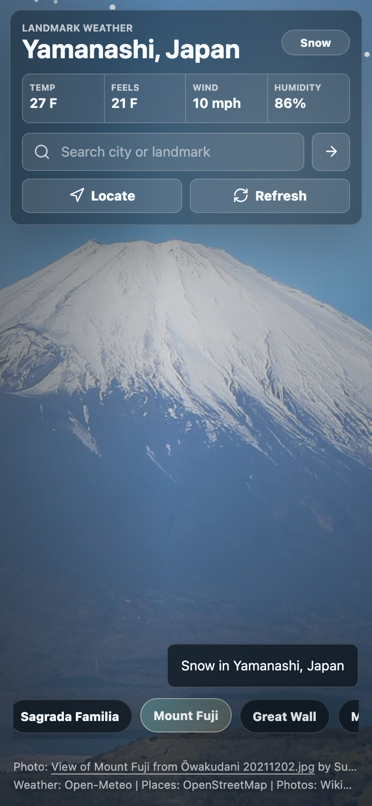

# Landmark Weather

A browser app that shows the current weather for a city or famous landmark as an
animated scene composited over a real landmark photo. Pick a landmark (or search
a city / use your location) and the background loads that place's photo, then
rain, snow, clouds, fog, sun, stars, or lightning are layered on top so the
landmark and the weather read as one image.

Published page: <https://pauldongin.github.io/weather/>

## Screenshots

| Desktop | Mobile |
| --- | --- |
|  |  |

## How it works

- **Landmark photo background** — famous landmarks resolve to their Wikipedia
  page image through the Wikimedia Commons metadata API; city searches and your
  current location fall back to a Wikimedia Commons photo search.
- **Composited weather** — a lightweight 2D `<canvas>` engine draws the weather
  on top of the photo and a per-condition color wash tints the scene:
  - Clear: sun glow and drifting light motes (stars and moon glow at night)
  - Cloudy: soft drifting clouds
  - Rain: slanted rain streaks with clouds
  - Storm: heavier rain with lightning flashes
  - Snow: drifting snowflakes
  - Fog: drifting mist bands
  - Wind: fast streaks across the scene
- Animation honors `prefers-reduced-motion`.

## Run

```sh
npm install
npm start
```

Open <http://127.0.0.1:5173>.

The app asks for browser location permission. If location is blocked, use the
search box or the landmark chips.

## Visual check

```sh
npm run test:visual
```

Playwright loads the app against the live APIs (desktop and mobile viewports),
selects a landmark, and verifies the Wikimedia photo background loads and the
weather canvas paints.

## Data sources

- Weather: Open-Meteo Forecast API
- City search: Open-Meteo Geocoding API
- Current-location place label: Nominatim / OpenStreetMap
- Famous landmark photos: Wikipedia page image API resolved through Wikimedia Commons metadata
- Search fallback photos and attribution: Wikimedia Commons API
